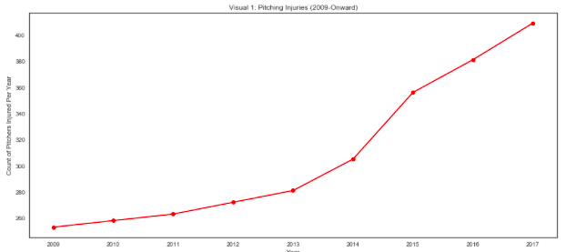
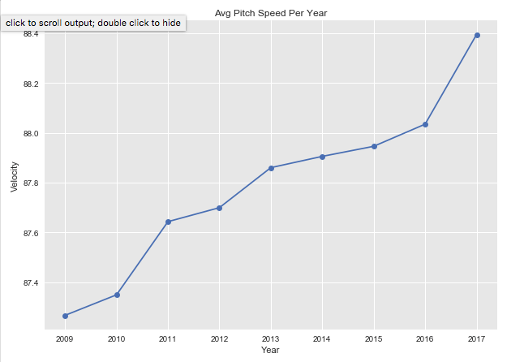
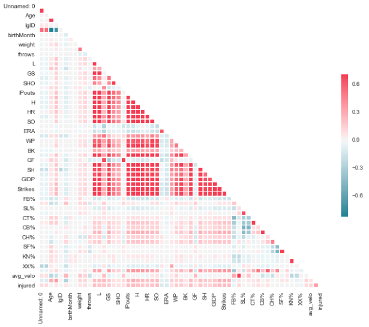
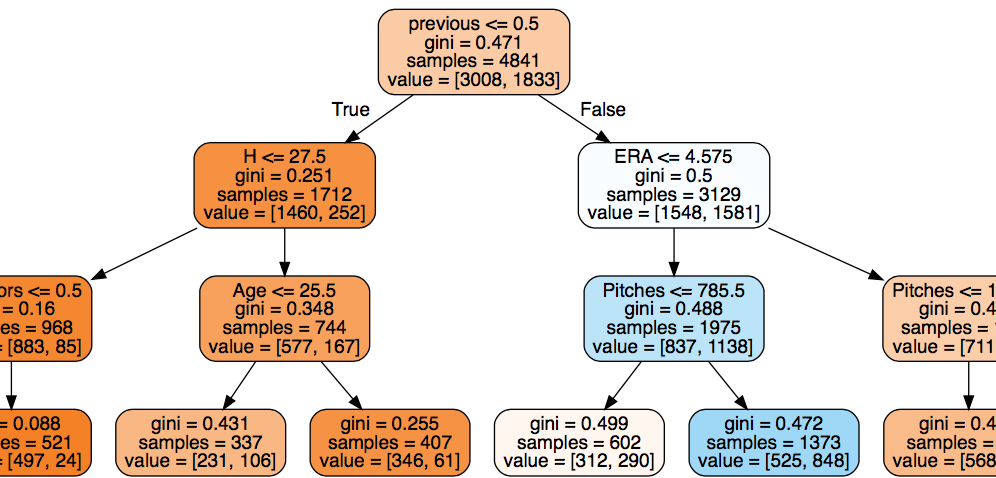
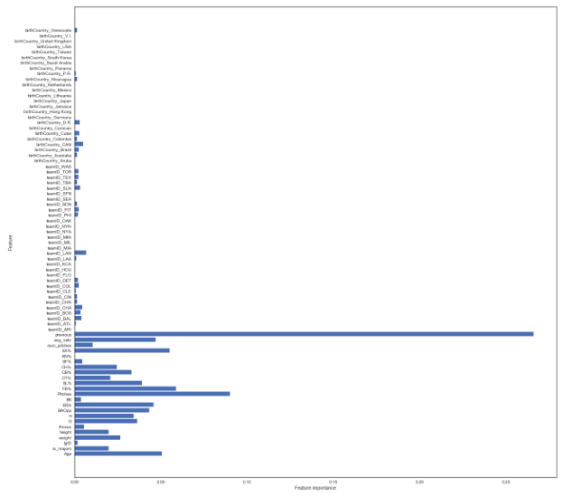

 # Predicting whether an MLB pitcher will suffer injuries based on prior year performance

The goal of the following report is to predict whether any pitcher in Major League Baseball ('MLB') will be injured in the upcoming season. 

## Data Sources
Various datasets were used. Injuries were gathered from MLB.com, pitching information from FanGraphs.com, and season stats from Lahman's Baseball Database and Chadwick Baseball Bureau. The time frame used was between 2009 and present day. 

## Introductory Problem
*Noting an increase in pitching injuries since 2009, many baseball teams have incorporated a limited pitch count per game to keep pitchers from suffering injuries. Nevertheless, the injuries continues to pile up (as shown below).*

<h6>
Visual 1: Pitching injuries are on the rise
</h6>

(injury graph)

<h6>
Visual 2: Average count of pitches thrown per year is decreasing
</h6>

(IP graph)

## HYPOTHESIS
*Despite the limited pitch count, pitchers are still suffering injuries at an increased rate. This is due to their desire to throw out faster and stronger pitches.* 

<h6>
Visual 3: Average speed per pitch is increasing
</h6>    

(velo graph)

## MODEL PREPARATION
Heatmaps were used to find which features were highly correlated so we could identify which features are redundant and therefore could be removed. Decision Trees were then utilized and helped to further find feature importances. These helped narrow it down to fifteen features (dropping 'previous injuries' since it was significantly relying on that chategory. 

(Large Heatmap)

 (graphiz DT)

(Feature importance)

## SHALLOW LEARNING
*In order to effectively run the models, the data is normalized so that every feature is scaled between 0 and 1. The data is split so that 70% is used for training and 30% is then used for testing. The 'injured' column is removed and used as our target to see how well the predictions are at correctly classifying the 'injured' labels.* 

See below chart for accuracy for models ran

  Type  | Gaussian|DT  |RF    |	LR  |SVC |
------- |--------:|---:|-----:|----:|---:|
Training|   N/A   |80% |70%   |64%  |64% |
Testing | 63%	  |63% |66%   |64%  |64% |	
AUC	|  N/A    |N/A |N/A   |68%  |65% |

##  ADDING SMOTE ('SYNTHETIC MINORITY OVER SAMPLING TECHNIQUE') 
*Since the majority of pitchers do not suffer injuries, the aforementioned models leaned heavily towards predicting 'non-injured'. As a result, the SMOTE approach was then used to incorporate dummy data points of 'injured' pitchers into the training set. The model was thus trained to avoid a heavy skew towards a 'non-injured' prediction which would hopefully lead to more accurate findings. Ultimately, the SMOTE approach validated our earlier model findings as the results predicted a similar accuracy both in terms of training and testing results.*

See below chart for accuracy for models ran with SMOTE

Type    | Gaussian|DT  |RF  |LR  |SVC |
--------|--------:|---:|---:|---:|---:|
Training| N/A	  |79% |69% |64% |63% |
Testing	|  63%    |61% |63% |64% |64% |
AUC	| N/A	  |N/A |N/A |68% |68% |

Below you can see a few of the results. Even though when SMOTE was applied the accuarcy stayed teh same, you can see by the confusion matricies that they stop only predicting that pitchers will not get injured, although many times incorrectly

## CONCLUSION
*Taking into account data from 2009-present day, this report tested against a classifier and four models in shallow learning, as well as tested the four models with the SMOTE approach. The overall prediction identified velocity, pitch count, earned run average and the pitcher's age as key determinants for injury risk. The best models determined with a 64% accuracy if a pitcher would be injured in the following season.  If used correctly, this modeling approach can help teams determine if it is safe to sign a pitcher to a long term deal or if they need to give a pitcher more rest throughout the season.*

## NEXT STEPS
- Predict the amount of days an injured pitcher would be on the disabled-list
- Incorporate playoff and minor league data
- Determine whether a specific team is more prone to injury and hypothesize reasoning
