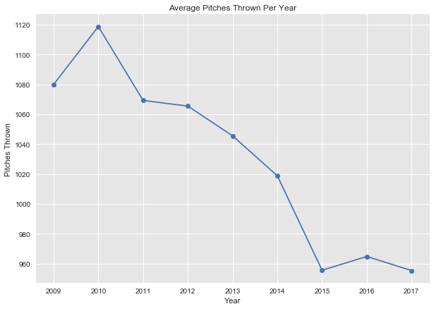

 # Predicting whether an MLB pitcher will suffer injuries based on prior year performance

The goal of the following report is to predict whether any pitcher in Major League Baseball ('MLB') will be injured in the upcoming season. 

## DATA SOURCES
Injury data was gathered from MLB.com, pitching data from FanGraphs.com, and season stats from Lahman's Baseball Database and Chadwick Baseball Bureau. The time frame used was between 2009 and present day. 

## INTRODUCTORY PROBLEM
Noting an increase in pitching injuries since 2009, many baseball teams have incorporated a limited pitch count per game to keep pitchers from suffering injuries. Nevertheless, the amount of injuries continues to increase (as shown below).

<h6>Increasing Number of Pitching Injuries</h6>

<h6>Decreasing Average Count of Pitches Thrown per Year</h6>

## HYPOTHESIS
Despite the limited pitch count, pitchers are still suffering injuries at an increased rate. This may be due to their desire to throw out faster and stronger pitches. 

<h6>
Increasing Average Speed per Pitch
</h6>    

## MODEL PREPARATION
Heatmaps were used to identify which features are highly correlated, and thus redundant and removable. Decision Trees were then utilized to further find feature importance - narrowing the pool down to fifteen features (and dropping the 'previous injuries' feature since its elevated count skewed the data). 

## SHALLOW LEARNING
In order to effectively run the models, the data was normalized so that every feature would be scaled between 0 and 1. The data was then split so that 70% was used for training and 30% was used for testing. Additionaly, the 'injured' column was removed and used as the target to identify how well the predictions correctly classified the 'injured' labels.

<h6>Model Accuracy</h6>

  Type  | Gaussian|DT  |RF    |	LR  |SVC |
------- |--------:|---:|-----:|----:|---:|
Training|   N/A   |80% |70%   |64%  |64% |
Testing | 63%	  |63% |66%   |64%  |64% |	
AUC	|  N/A    |N/A |N/A   |68%  |65% |

<h6>New Feature Importances with Final Categories</h6>

##  APPLYING SMOTE ('SYNTHETIC MINORITY OVER SAMPLING TECHNIQUE') 
The aforementioned models leaned heavily towards predicting 'non-injured' as the majority of pitchers did not suffer injuries. Using the SMOTE approach, dummy data points of 'injured' pitchers were incorporated into the training set to better train the model (i.e., to avoid a heavy skew towards a 'non-injured' prediction which would hopefully lead to more accurate findings). Ultimately, the SMOTE approach validated our earlier findings as the data predicted a similar accuracy both in terms of training and testing results.

<h6>SMOTE Model Accuracy</h6>

Type    | Gaussian|DT  |RF  |LR  |SVC |
--------|--------:|---:|---:|---:|---:|
Training| N/A	  |79% |69% |64% |63% |
Testing	|  63%    |61% |63% |64% |64% |
AUC	| N/A	  |N/A |N/A |68% |68% |

<h6>Random Forest Confusion Matrices Reflecting Model Accuracy</h6>

Both matrices correctly predicted 'non-injured' results - the first matrix without SMOTE and the second with SMOTE applied.  

## CONCLUSION
Taking into account data from 2009 to present day, this report tested against a classifier and four models in shallow learning, as well as tested the four models with the SMOTE approach. The overall prediction identified velocity, pitch count, earned run average, and the pitcher's age as key determinants for injury risk. The best models determined with a 64% accuracy if a pitcher would be injured in the following season. If used correctly, this modeling approach can help teams determine if it is safe to sign a pitcher to a long term deal or if they need to give a pitcher more rest throughout the season.

## NEXT STEPS
- Predict the amount of days an injured pitcher would be on the disabled-list
- Incorporate playoff and minor league data
- Determine whether a specific team is prone to injury and hypothesize reasoning
